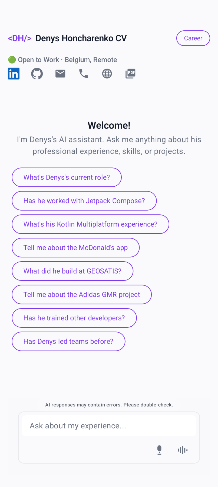
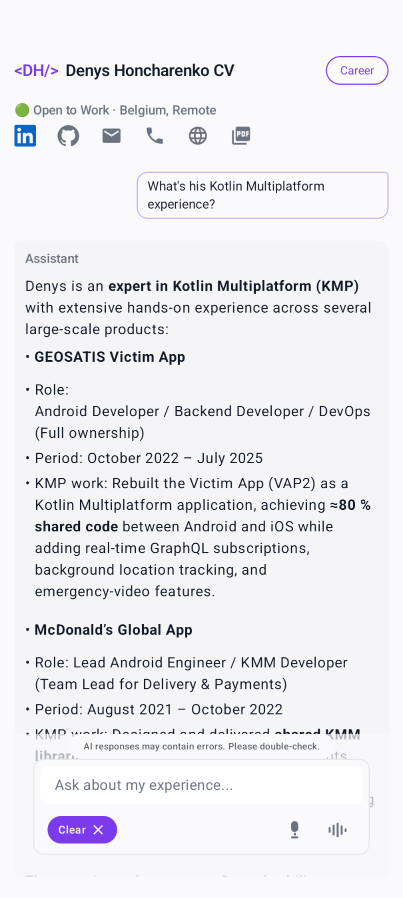
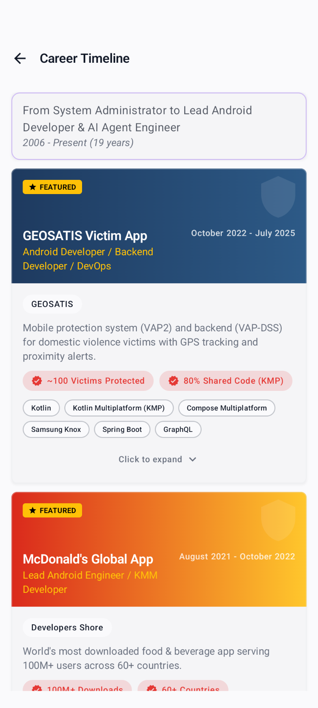
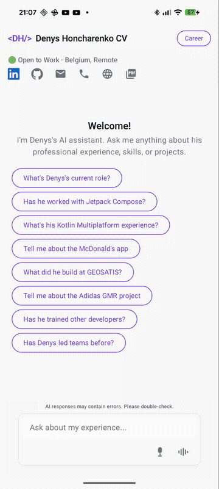

# CV Agent

> AI-powered mobile app that lets recruiters and developers explore my professional experience through natural conversation.

[](https://kotlinlang.org)
[](https://www.jetbrains.com/lp/compose-multiplatform/)
[](LICENSE)

<p align="center">
  
  
  
</p>

<p align="center">
  <a href="https://play.google.com/store/apps/details?id=io.github.devmugi.cv.agent">📱 Google Play</a> •
  <a href="https://devmugi.github.io/devmugi/">🌐 Web Version</a> •
  <a href="https://github.com/devmugi">👤 GitHub Profile</a>
</p>

<p align="center">
  
</p>

## Features

- 🤖 **AI Chat Interface** - Ask anything about my experience, skills, or projects
- 📱 **Kotlin Multiplatform** - Shared business logic across Android & iOS
- ⚡ **Streaming Responses** - Real-time token streaming from Groq LLM
- 🎯 **Smart Suggestions** - AI extracts relevant project recommendations
- 📊 **Career Timeline** - Visual journey through 19 years of experience
- 🔍 **LLM Observability** - OpenTelemetry tracing with Arize Phoenix

## Architecture

```
┌─────────────────────────────────────────────────────────────┐
│                        android-app                          │
│                      (Entry Point, DI)                      │
└─────────────────────────┬───────────────────────────────────┘
                          │
┌─────────────────────────▼───────────────────────────────────┐
│                         shared                              │
│                    (Koin DI Wiring)                         │
└───┬─────────┬─────────┬─────────┬─────────┬─────────┬───────┘
    │         │         │         │         │         │
┌───▼───┐ ┌───▼───┐ ┌───▼────┐ ┌──▼──┐ ┌───▼────┐ ┌───▼────┐
│shared │ │shared │ │shared  │ │shared│ │shared  │ │shared  │
│-agent │ │-agent │ │-career │ │-ui   │ │-analytics│-crash │
│       │ │-api   │ │-projects│       │ │        │ │-lytics │
└───┬───┘ └───┬───┘ └───┬────┘ └──┬──┘ └────────┘ └────────┘
    │         │         │         │
    └─────────┴─────────┴─────────┘
                  │
        ┌─────────▼─────────┐
        │   shared-domain   │
        │  (Pure Models)    │
        └───────────────────┘
```

| Module | Purpose |
|--------|---------|
| `shared-domain` | Pure domain models (ChatState, Message) - zero dependencies |
| `shared-agent-api` | Groq LLM client with streaming SSE + OpenTelemetry tracing |
| `shared-agent` | ChatViewModel, system prompts, suggestion extraction |
| `shared-career-projects` | CV data models and career UI components |
| `shared-ui` | Reusable Compose UI components |
| `shared-analytics` | Firebase Analytics integration |
| `shared-crashlytics` | Crash reporting |
| `shared` | Koin dependency injection wiring |

## Getting Started

### Prerequisites

- Android Studio Ladybug (2024.2.1) or later
- JDK 11+
- Android SDK 36
- [Groq API key](https://console.groq.com/) (free tier available)

### Setup

1. **Clone the repository**
   ```bash
   git clone https://github.com/devmugi/cv-agent.git
   cd cv-agent
   ```

2. **Configure API key**
   ```bash
   echo "GROQ_API_KEY=your_api_key_here" >> local.properties
   ```

3. **Build and run**
   ```bash
   ./gradlew :android-app:installDevDebug
   ```

### Build Variants

| Variant | App ID | Use Case |
|---------|--------|----------|
| `devDebug` | `io.github.devmugi.cv.agent.dev` | Development with local Phoenix tracing |
| `devRelease` | `io.github.devmugi.cv.agent.dev` | Testing release builds locally |
| `prodRelease` | `io.github.devmugi.cv.agent` | Production build for Play Store |

```bash
# Development
./gradlew :android-app:installDevDebug

# Production bundle
./gradlew :android-app:bundleProdRelease
```

## Tech Stack

| Category | Technology |
|----------|------------|
| **UI** | [Compose Multiplatform](https://www.jetbrains.com/lp/compose-multiplatform/), [Arcane Design System](https://github.com/nicemui/arcane) |
| **LLM** | [Groq](https://groq.com/) (llama-3.3-70b-versatile) |
| **Observability** | [OpenTelemetry](https://opentelemetry.io/), [Arize Phoenix](https://docs.arize.com/phoenix) |
| **DI** | [Koin](https://insert-koin.io/) |
| **Networking** | [Ktor](https://ktor.io/) with SSE streaming |
| **Analytics** | Firebase Analytics, Crashlytics |

> 📊 **Prompt Evaluation**: This project includes a framework for testing prompt variants and comparing LLM performance. See [docs/evaluation.md](docs/evaluation.md) for details.

> 🔍 **LLM Observability**: Traces are collected via OpenTelemetry and can be viewed in Arize Phoenix. See [docs/observability.md](docs/observability.md) for setup.

## Development

```bash
# Run tests
./gradlew :shared-agent:testAndroidUnitTest

# Code quality checks
./gradlew qualityCheck

# Format code
./gradlew ktlintFormat
```

## Contributing

Contributions are welcome! Please:

1. Fork the repository
2. Create a feature branch (`git checkout -b feature/amazing-feature`)
3. Commit your changes using [conventional commits](https://www.conventionalcommits.org/)
4. Push to the branch (`git push origin feature/amazing-feature`)
5. Open a Pull Request

## License

This project is licensed under the Apache License 2.0 - see the [LICENSE](LICENSE) file for details.

## Author

**Denys Honcharenko** - Lead Android Developer & AI Agent Engineer

- 🌐 [Portfolio](https://devmugi.github.io/devmugi/)
- 💼 [LinkedIn](https://www.linkedin.com/in/denyshoncharenko/)
- 🐙 [GitHub](https://github.com/devmugi)

---

<p align="center">
  Built with ❤️ using Kotlin Multiplatform
</p>
